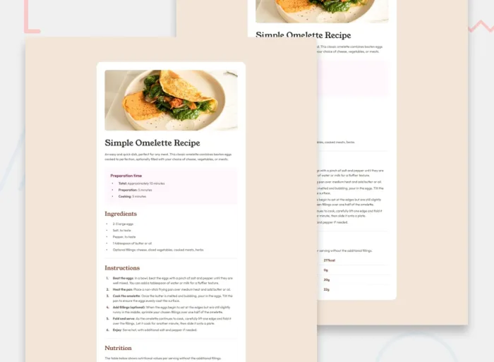

# FrontendMentor-recipe-page-code-challenge
Recipe Page - This small project builds out a recipe's blog post website page with Semantic HTML and CSS.

## Frontend Mentor - Recipe page solution

Recipe Page – A responsive recipe page built with Semantic HTML5 and modern CSS, focusing on clean typography, accessibility, and responsive layouts.

This is a solution to the [Recipe page challenge on Frontend Mentor](https://www.frontendmentor.io/challenges/recipe-page-KiTsR8QQKm). Frontend Mentor challenges help you improve your coding skills by building realistic projects.

## Table of contents

* [Overview](#overview)

  * [The challenge](#the-challenge)
  * [Screenshot](#screenshot)
  * [Links](#links)
* [My process](#my-process)

  * [Built with](#built-with)
  * [What I learned](#what-i-learned)
  * [Useful resources](#useful-resources)
* [Author](#author)

## Overview

### The challenge

Users should be able to:

* View the optimal layout depending on their device's screen size.
* Read the recipe with clear typography and accessible spacing.
* Experience a responsive interface optimized for mobile and desktop devices.
* Navigate the page using semantic HTML elements that improve accessibility.

### Screenshot



### Links

* Live URL: **[Recipe Page](https://devkatiareis.github.io/FrontendMentor-recipe-page-code-challenge/)**
* Solution URL: **[Frontend Mentor Solution](https://www.frontendmentor.io/solutions/responsive-recipe-page-built-with-semantic-html-css-and-accessibility-saKpwn2dau)**
* Project Repo URL: **[GitHub Repository](https://github.com/devkatiareis/FrontendMentor-recipe-page-code-challenge)**

## My process

### Built with

- Semantic HTML5 markup
- CSS Custom Properties (Variables)
- Flexbox
- Responsive Design & Mobile-first workflow
- Accessibility best practices
  - Skip Link
  - ARIA landmarks
  - Keyboard focus styles
- Google Fonts
  * **Young Serif** (Headings)
  * **Outfit** (Body Text)

### What I learned

During this challenge, I strengthened my understanding of building clean, responsive layouts using semantic HTML and modern CSS. Rather than relying on utility frameworks, I focused on creating a well-structured document with reusable CSS components and consistent spacing.

This project also reinforced the importance of using appropriate semantic elements such as `<main>`, `<section>`, `<article>`, `<table>`, `<ul>`, and `<ol>` to improve both accessibility and document structure.

I also learned that accessibility is more than using semantic HTML. Small improvements such as implementing a keyboard-accessible skip link, using descriptive alternative text, leveraging aria-labelledby, and preserving native list markers can significantly improve the experience for assistive technology users while keeping the markup simple.

I also practiced creating a responsive card layout using Flexbox while maintaining consistent typography with the **Young Serif** and **Outfit** font families provided in the project assets.

```html
<main id="main-content" class="recipe-card>

  <figure class="recipe-header">
    
  </figure>

  <article class="recipe-content">
    <h1 class="recipe-title" id="recipe-main-title">
      Simple Omelette Recipe
    </h1>
  </article>
</main>
```

```css
:root
  /* Colors */
  --white: hsl(0, 0%, 100%);

  --stone-100: hsl(30, 54%, 90%);
  --stone-150: hsl(30, 18%, 87%);
  --stone-600: hsl(30, 10%, 34%);
  --stone-900: hsl(24, 5%, 18%);

  --brown-800: hsl(14, 45%, 36%);

  --rose-50: hsl(330, 100%, 98%);
  --rose-800: hsl(332, 51%, 32%);

  /* Typography */
  --font-heading: "Young Serif", Georgia, serif;
  --font-body: "Outfit", Arial, sans-serif;
  
  --font-heading: "Young Serif", serif;
  --font-body: "Outfit", sans-serif;

  --space-400: 2rem;
  --radius-lg: 1.5rem;
```

### Useful resources

- MDN Web Docs – Semantic HTML
  A great reference for choosing meaningful HTML elements and improving accessibility.
[MDN Web Docs - Semantic HTML](https://developer.mozilla.org/en-US/docs/Glossary/Semantics)

- MDN Web Docs – Flexbox 
  Helped reinforce responsive layout techniques throughout the project.
[MDN Web Docs - Flexbox](https://developer.mozilla.org/en-US/docs/Learn_web_development/Core/CSS_layout/Flexbox)

- MDN Web Docs – :focus-visible
[MDN Web Docs - Focus Visible](https://developer.mozilla.org/en-US/docs/Web/CSS/Reference/Selectors/:focus-visible)

- Google Fonts - Useful for understanding the typography specifications, although this project includes the required font files locally.
[Google Fonts](https://fonts.google.com)

## Author

* Website - [Katia Reis](https://www.katiareis.com.br)
* Frontend Mentor - [@devkatiareis](https://www.frontendmentor.io/profile/devkatiareis)
* LinkedIn - [Katia Reis](https://www.linkedin.com/in/katiareis/)
